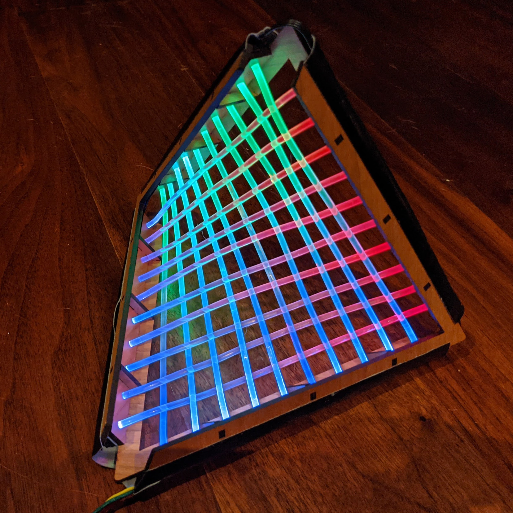

# fiber-optic-hyperbolic-paraboloid
design files for an illuminated hyperbolic paraboloid ruled with illuminated fiber optic cables

A brief description of the build:

Materials:
-1/8" (3.2mm) wood sheet for laser cutting
-3mm thick EVA foam with an adhesive backing
-small (2mm wide or similar) zip ties
-3mm diameter solid-core side-glow fiber optic cable
-optional: wood glue
-4 10-led lengths of a 60 LEDs/meter WS2812b LED strip containing 3535 sized LEDs, without any joins in the strips (if you use a strip with 5050 LEDs, you'll need to make the squares in the EVA foam strip a bit wider to accomodate them)
-duct tape (1" width is ideal, but you can trim a wider strip down)
-hookup wire/solder
-microcontroller for coding the patterns

Laser cut the frame pieces from the wood sheet, and assemble them into a 3D V-shaped frame using the connector pieces. I was able to press-fit the pieces well enough to hold the frame together quite sturdily, but you might want to place a bit of wood glue on the tabs and slots before joining them in order to hold the assembly together. 

Once the frame is assembled, take an end of the fiber-optic cable, slide it through a hole in one of the edges, and run it across the frame to come out the opposite hole on the other side. The holes are just over 3mm in diamter, so if the fit is tight, it may help to cut the end of the fiber optic cable at an angle to run it through the hole. Once it has passed through the hole at the other side, pull it past the hole about 5mm or so (more is fine, you'll trim it back later) and cinch the end as tightly as you can with a small zip tie very close to where the fiber optic cable emerges from the hole. Use a pliers to pull the end of the zip tie as tightly as you can.

From the other end of the fiber-optic cable, pull the cable taut (you'll want to eliminate as much of the curve in the cable as possible, though it's hard to get it completely straight), and cinch the end at the other side with a zip-tie as close to the frame as possible. Using scissors or snippers, clip the end of the fiber cable about 5mm or so past the end of the zip tie (exactness doesn't matter as you'll trim it back later). When attaching the zip-ties, try to line up the ends so that they point in the same direction as shown (TBD - picture here). Trim the excess length of zip tie that extends past the connector. Repeat this process until all the holes in the frame are filled with fiber optic cables. When you string the second set of sides, you'll need to plan how to weave the cables around the ones from the first side...(TBD)

Once all the cables are in place and secured tightly with zip ties, trim all the ends of the fiber optic cables as cleanly as possible using a craft knife. Make the cut about 2-3mm past the end of the zip tie.

Next, laser cut the EVA foam pieces. The foam pieces with notched edges adhere directly to the edges of the frame with the notches sitting around the zip tie clips. (TBD - picture here). After those are in place, stick the foam strips with squares over the first foam piece so that the end of each fiber optic piece sits squarely in the middle of a square hole.

The segments of LED strip will be placed over the EVA foam strips with one LED sitting in each square hole. You'll need to figure out the correct length of hookup wire to solder each of the 10-LED segments together in a string. Once soldered together, place each strip along an edge of the frame with its LEDs at the ends of the fiber optic cables. Take a 1" piece of duct tape the length of each frame edge and tape each strip in place securely.

Now all you need to do is connect a microcontroller to your LED strip and start coding some patterns!

