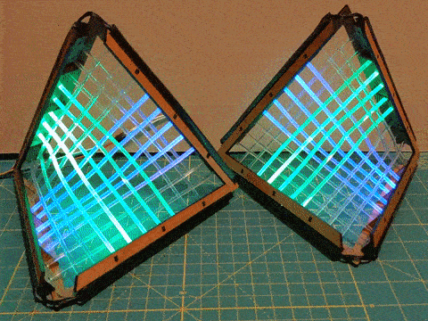

# fiber-optic-hyperbolic-paraboloid
design files for an illuminated hyperbolic paraboloid ruled with illuminated fiber optic cables

This repository contains the design files and code to build the illulminated fiber-optic hyperbolic paraboloid project. Detailed build instructions may be found at my blog here: <a href="https://www.geekmomprojects.com/fiber-optic-hyperbolic-paraboloid/">https://www.geekmomprojects.com/fiber-optic-hyperbolic-paraboloid/</a>

The included demo code is a slight adaptation of Adafruit's CircuitPython FancyLED demo code (<a href = "https://github.com/adafruit/Adafruit_CircuitPython_FancyLED">https://github.com/adafruit/Adafruit_CircuitPython_FancyLED)</a>, running on a Teensy 4.0. A fairly fast processor will be needed to run CircuitPython code controlling 40 LEDs.

